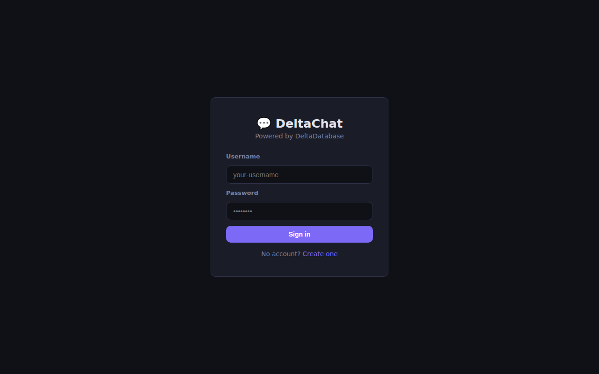
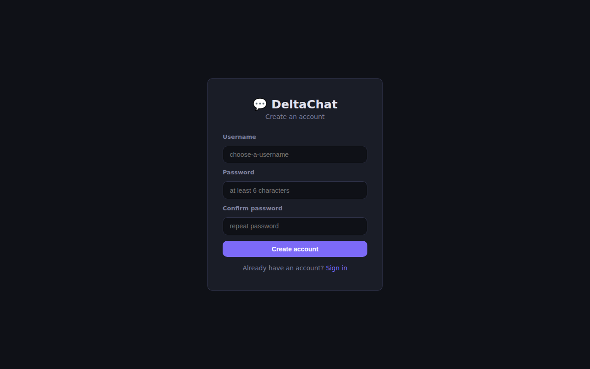
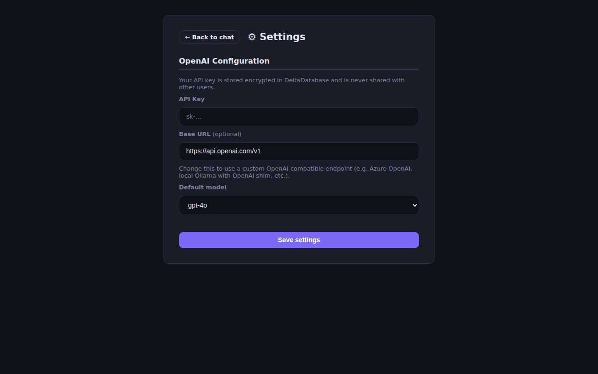
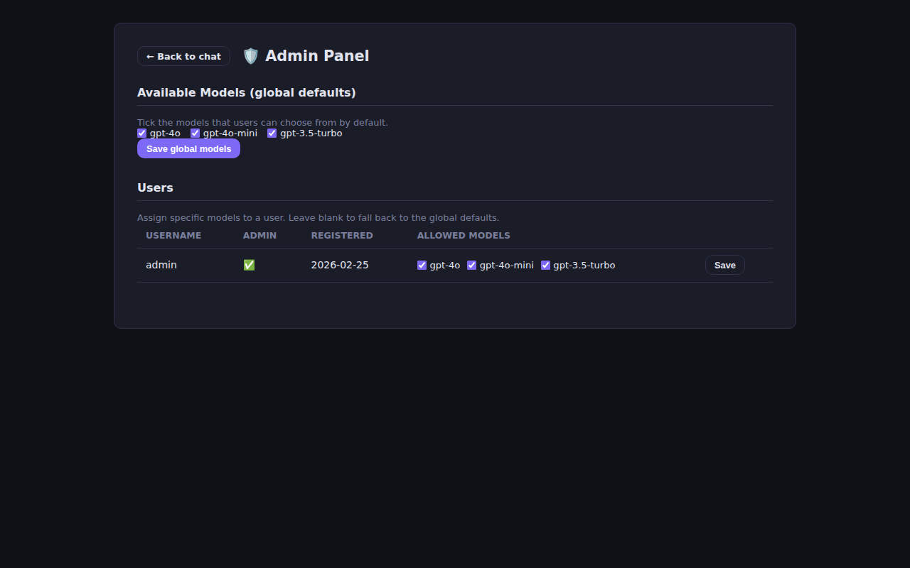

# Example: Chat Application

This example ships a **complete, runnable chat application** in
[`examples/chat/`](https://github.com/DeltaRule/DeltaDatabase/tree/main/examples/chat)
that uses DeltaDatabase as its sole storage backend.

The application is built with [Flask](https://flask.palletsprojects.com/) and
tested with [Playwright](https://playwright.dev/).

---

## Screenshots

### Sign in



### Register



### Chat (empty state)


### Chat (conversation)


### Settings



### Admin Panel



---

## Features

| Feature | Details |
|---|---|
| 🔐 Authentication | Session-based login/register — every page except `/login` and `/register` is protected |
| 💬 Per-user chats | Chat histories are isolated per user |
| ⚙ User settings | Each user stores their own OpenAI API key, custom base URL, and default model |
| 🛡 Admin panel | Admins see all users and assign per-user allowed model lists |
| 🤖 OpenAI backend | OpenAI-compatible APIs only (key + optional custom endpoint) |
| 🗄 DeltaDatabase | All data stored exclusively in DeltaDatabase |
| 🧪 Playwright tests | End-to-end browser tests for all major flows |

---

## Quick Start

### Docker Compose

```bash
cd examples/chat
docker compose up --build
```

Open **http://localhost:5000**.
Default admin credentials: `admin` / `admin123`.

To run without a real OpenAI key, enable mock mode:

```bash
MOCK_OPENAI=true docker compose up --build
```

### Local Python

```bash
# Start DeltaDatabase
docker compose -f ../../deploy/docker-compose/docker-compose.all-in-one.yml up -d

# Install deps and run
pip install -r examples/chat/requirements.txt
DELTA_DB_URL=http://localhost:8080 MOCK_OPENAI=true python examples/chat/app.py
```

---

## DeltaDatabase Schema

The app stores data across five logical databases — no external database is needed:

| Database | Key pattern | Contents |
|---|---|---|
| `chat_users` | `<username>` | Password hash, admin flag, creation timestamp |
| `chat_sessions` | `<username>__<chat_id>` | Full message history, title, timestamps |
| `chat_index` | `<username>` | Ordered list of chat IDs for that user |
| `chat_user_config` | `<username>` | OpenAI API key, base URL, default model |
| `chat_admin_config` | `global` | Global available models + per-user overrides |
| `chat_admin_config` | `users_index` | Ordered list of all registered usernames |

### Schema example — a chat session

```json
{
  "username": "alice",
  "id": "a1b2c3d4e5",
  "title": "What is DeltaDatabase?",
  "messages": [
    {"role": "user",      "content": "What is DeltaDatabase?"},
    {"role": "assistant", "content": "An encrypted-at-rest JSON database written in Go."}
  ],
  "created_at": "2026-02-25T10:00:00",
  "updated_at": "2026-02-25T10:00:05"
}
```

---

## Environment Variables

| Variable | Default | Description |
|---|---|---|
| `DELTA_DB_URL` | `http://localhost:8080` | DeltaDatabase REST endpoint |
| `DELTA_DB_CLIENT_ID` | `chat-app` | Client ID for DeltaDatabase auth |
| `FLASK_SECRET_KEY` | random | Flask session signing key |
| `ADMIN_USERNAME` | `admin` | Username created on first run |
| `ADMIN_PASSWORD` | `admin123` | Password for the default admin |
| `MOCK_OPENAI` | `false` | Return stub replies instead of calling OpenAI |
| `PORT` | `5000` | HTTP port |

---

## Running Playwright Tests

```bash
# Start the stack in mock mode
MOCK_OPENAI=true docker compose -f examples/chat/docker-compose.yml up -d --build

# Install and run tests
cd examples/chat/tests
npm install
npx playwright install --with-deps chromium
npm test
```

Test suites:

| File | Covers |
|---|---|
| `auth.spec.js` | Login, register, protected-route redirects, logout |
| `chat.spec.js` | New chat, send/receive message, title update, delete |
| `settings.spec.js` | Open settings, save API key, model selection, navigation |
| `admin.spec.js` | Admin visibility, model assignment, non-admin blocked |

---

## Architecture

```
Browser
   │  HTTP
   ▼
Flask (examples/chat/app.py)   :5000
   │  REST (HTTP/JSON)
   ▼
DeltaDatabase Main Worker      :8080
   │  gRPC
   ▼
DeltaDatabase Processing Worker
   │
Encrypted JSON on disk
```

The Flask app holds a single DeltaDatabase Bearer token (re-obtained automatically
on expiry via a new `POST /api/login` call) and maps every application concept — users, chats, config — to
DeltaDatabase entities. No SQL, no Redis, no separate session store.

---

## Source

Full source code:
[`examples/chat/`](https://github.com/DeltaRule/DeltaDatabase/tree/main/examples/chat)
